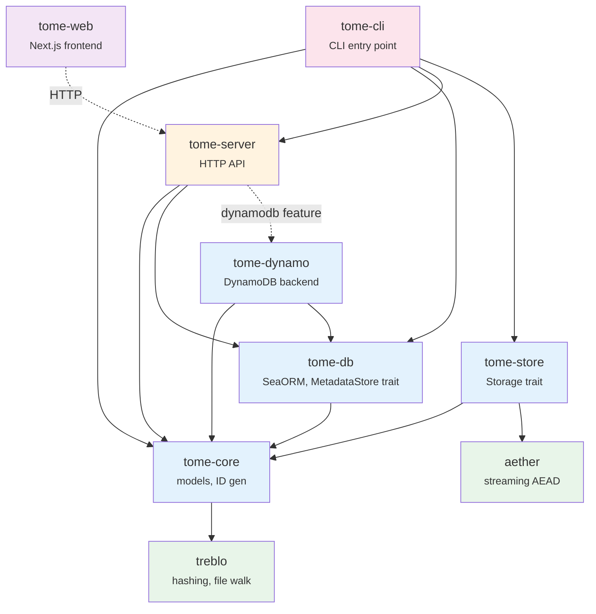

# Architecture

> Technical reference for the **tome** file change tracking system.
> For detailed documentation, see the files under `docs/`.

---

## Crate Structure

| Crate | Description |
|-------|-------------|
| `tome-core` | Hash computation (delegates to treblo), ID generation (Sonyflake), shared models |
| `tome-db` | SeaORM entities, migrations, query operations (`ops/` modules), `MetadataStore` trait |
| `tome-dynamo` | DynamoDB `MetadataStore` implementation (single-table design) |
| `tome-store` | Async `Storage` trait + implementations: Local, SSH, S3, Encrypted |
| `tome-server` | HTTP API server (axum 0.8, `routes/` modules) |
| `tome-cli` | Unified CLI: scan / watch / store / sync / diff / restore / tag / verify / gc / serve |
| `tome-web` | Next.js 16 web frontend (Server Components, Tailwind CSS v4) |
| `aether` | Streaming AEAD encryption: XChaCha20-Poly1305 / ChaCha20-Poly1305 / AES-256-GCM + Argon2id KDF |
| `treblo` | Hash algorithms (xxHash64 / SHA-256 / BLAKE3), file-tree walk, hex utilities |

`tome-sync` is not a separate crate; it lives in `tome-cli/src/commands/sync.rs`.

### Dependency Graph

Legacy crates (`ichno`, `ichno_cli`, `ichnome`, `ichnome_cli`, `ichnome_web`, `ichnome_web_front`, `optional_derive`) are archived under `obsolete/` and excluded from the workspace.

---

## Design Principles

1. **Single Source of Truth** — Each piece of information lives in exactly one place. Caches are named explicitly (`entry_cache`).
2. **Local-first** — SQLite is a first-class citizen. A remote server DB is just one possible sync target.
3. **Event sourcing** — Changes are recorded as immutable snapshots. Current state is derived from the snapshot chain.
4. **Storage internalization** — The location of every stored blob is tracked in the `replicas` table, not assumed.
5. **Encryption as a layer** — `EncryptedStorage<S>` wraps any `Storage` implementation transparently.

---

## Detailed Documentation

### Architecture (`docs/arch/`)

| Document | Description |
|----------|-------------|
| [Database Schema](docs/arch/database-schema.md) | 10-table schema, ER diagram, table descriptions, DDL management |
| [Hash Strategy](docs/arch/hash-strategy.md) | Three-stage change detection filter (mtime -> xxHash64 -> SHA-256/BLAKE3) |
| [Encryption](docs/arch/encryption.md) | aether binary format, STREAM construction, key management |
| [Storage](docs/arch/storage.md) | URL schemes, blob path layout |
| [HTTP API](docs/arch/http-api.md) | Endpoint reference, response shapes |
| [Web Frontend](docs/arch/web-frontend.md) | Next.js directory structure, navigation, implementation notes |
| [Central Sync](docs/arch/central-sync.md) | Two-layer sync, modes, AWS IAM auth, machine_id allocation |
| [Lambda Deployment](docs/arch/lambda-deployment.md) | Build, environment variables, backend selection |
| [DynamoDB Backend](docs/arch/dynamodb.md) | Single-table design, access patterns, key schema, GSIs |

### Generated Schema & API (`docs/schema/`)

| File | Generated by | Description |
|------|-------------|-------------|
| [`openapi.json`](docs/schema/openapi.json) | `cargo run -p tome-server --example generate_openapi` | OpenAPI 3.0 spec (pretty-printed) |
| [`tome-db.sql`](docs/schema/tome-db.sql) | `cargo run -p tome-db --example generate_schema` | SQLite DDL from SeaORM migrations |

### Architecture Decision Records (`docs/adr/`)

| ADR | Title |
|-----|-------|
| [ADR-001](docs/adr/001-sonyflake-ids.md) | Sonyflake ID Generation |
| [ADR-002](docs/adr/002-content-addressable-storage.md) | Content-Addressable Storage |
| [ADR-003](docs/adr/003-local-first-sqlite.md) | Local-First with SQLite |
| [ADR-004](docs/adr/004-metadatastore-trait.md) | MetadataStore Trait Abstraction |
| [ADR-005](docs/adr/005-dynamodb-single-table.md) | DynamoDB Single-Table Design |
| [ADR-006](docs/adr/006-declarative-ddl.md) | Declarative DDL over Runtime Migrations |

---

## Known Design Issues

### 1. `entry_cache` is current-state only

`entry_cache` is a materialized view of the latest snapshot per path. It cannot answer "what did the repository look like at time T?" without re-querying the `entries` + `snapshots` tables. Features like `tome restore` must bypass `entry_cache` entirely.

### 2. `tome restore` requires store availability

To restore a file from a historical snapshot, the corresponding blob must exist in at least one reachable store. There is currently no `--check` flag to verify replica availability before attempting a restore.

### 3. ID generation depends on machine-id and start-time

Sonyflake IDs are generated from `(timestamp, machine_id, sequence)`. The epoch is fixed at `2023-09-01 00:00:00 UTC`. Changing either `start_time` or `machine_id` mid-stream breaks ID ordering and risks collisions.
