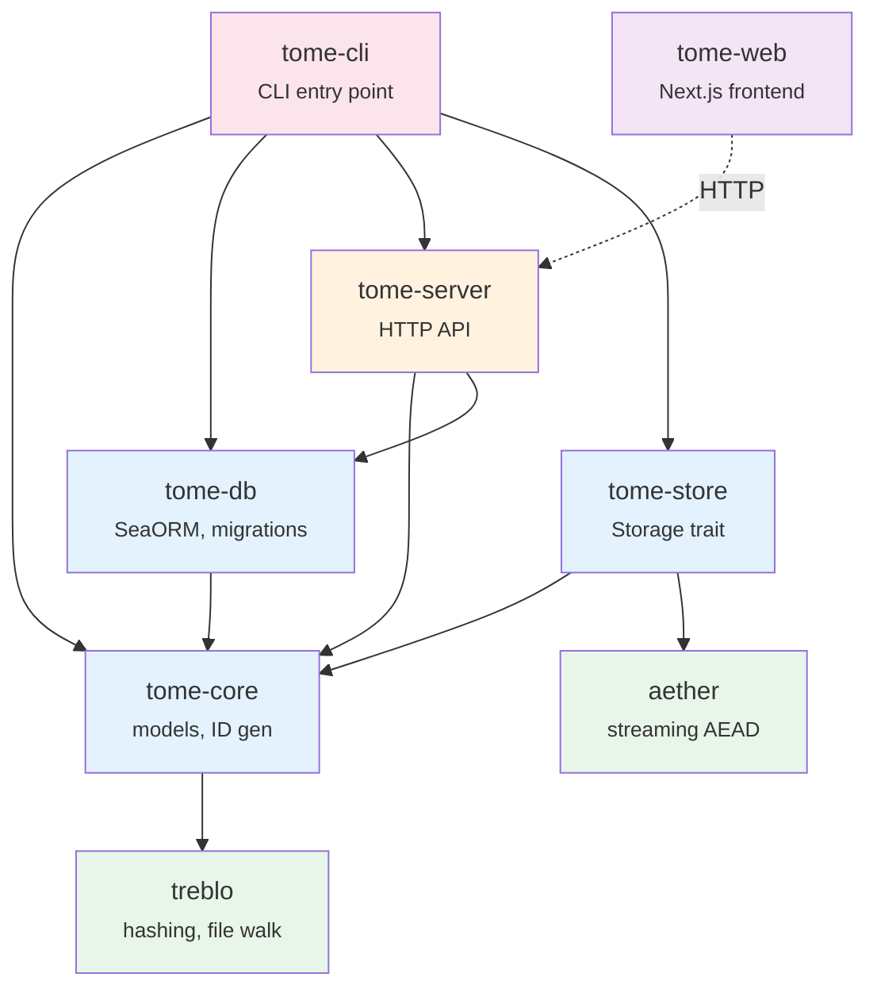
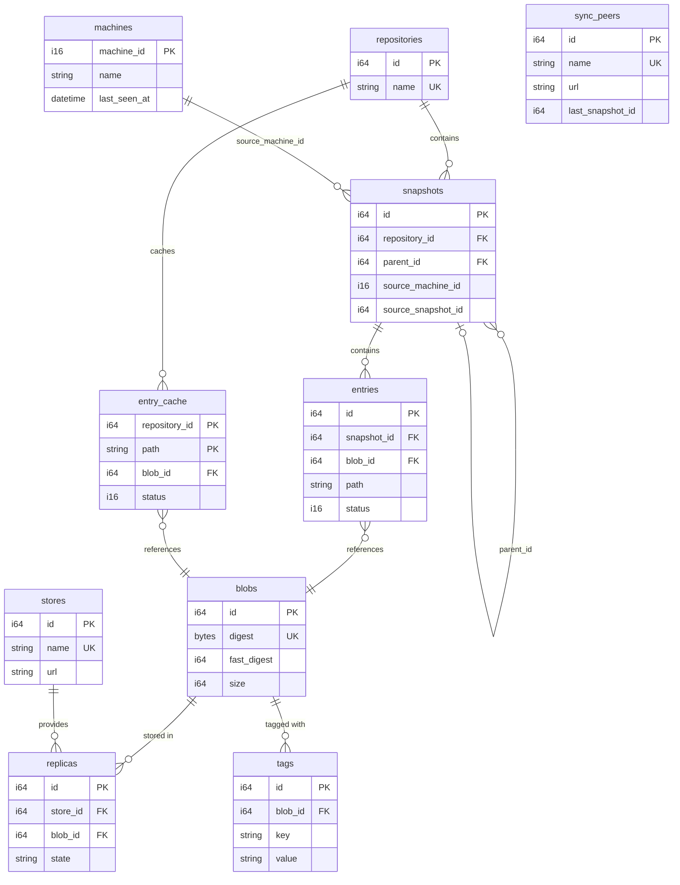
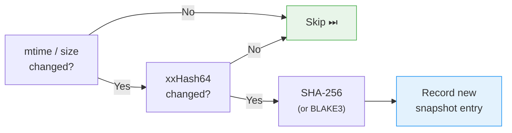
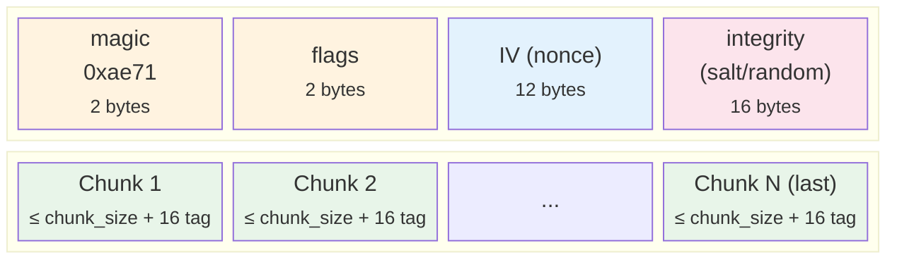
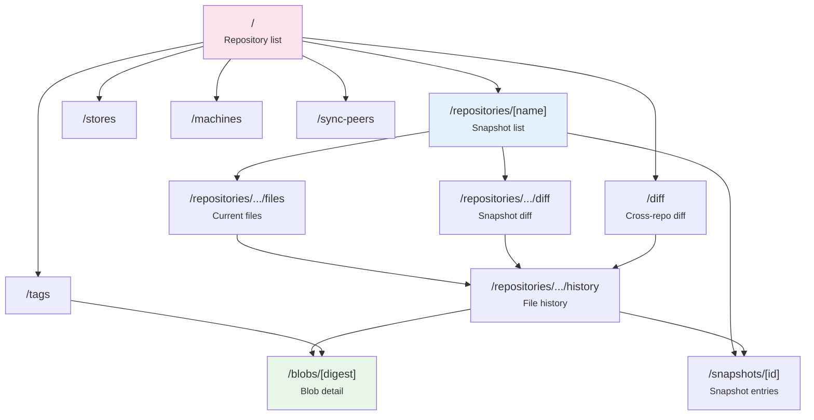
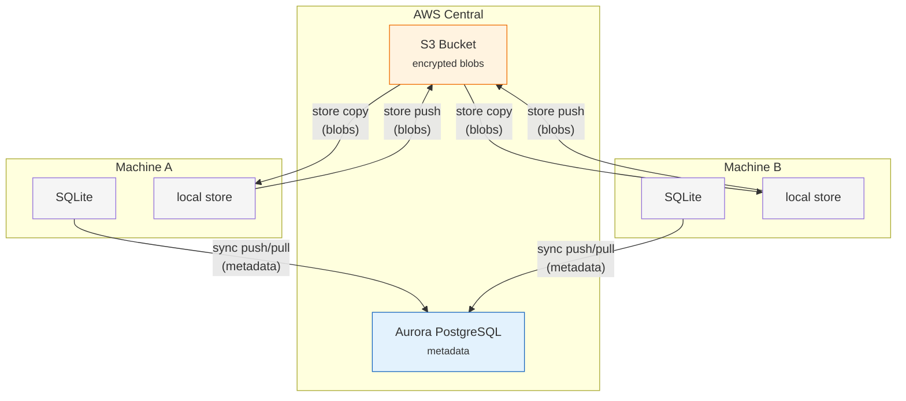

# Architecture

> Technical reference for the **tome** file change tracking system.

---

## Crate structure

| Crate | Description |
|-------|-------------|
| `tome-core` | Hash computation (delegates to treblo), ID generation (Sonyflake), shared models |
| `tome-db` | SeaORM entities, migrations, query operations (`ops/` modules) |
| `tome-store` | Async `Storage` trait + implementations: Local, SSH, S3, Encrypted |
| `tome-server` | HTTP API server (axum 0.8, `routes/` modules) |
| `tome-cli` | Unified CLI: scan / watch / store / sync / diff / restore / tag / verify / gc / serve |
| `tome-web` | Next.js 16 web frontend (Server Components, Tailwind CSS v4) |
| `aether` | Streaming AEAD encryption: AES-256-GCM / ChaCha20-Poly1305 + Argon2id KDF |
| `treblo` | Hash algorithms (xxHash64 / SHA-256 / BLAKE3), file-tree walk, hex utilities |

`tome-sync` is not a separate crate; it lives in `tome-cli/src/commands/sync.rs`.

### Dependency graph



Legacy crates (`ichno`, `ichno_cli`, `ichnome`, `ichnome_cli`, `ichnome_web`, `ichnome_web_front`, `optional_derive`) are archived under `obsolete/` and excluded from the workspace.

---

## Design principles

1. **Single Source of Truth** — Each piece of information lives in exactly one place. Caches are named explicitly (`entry_cache`).
2. **Local-first** — SQLite is a first-class citizen. A remote server DB is just one possible sync target.
3. **Event sourcing** — Changes are recorded as immutable snapshots. Current state is derived from the snapshot chain.
4. **Storage internalization** — The location of every stored blob is tracked in the `replicas` table, not assumed.
5. **Encryption as a layer** — `EncryptedStorage<S>` wraps any `Storage` implementation transparently.

---

## Database schema

10 tables. All IDs are Sonyflake `i64` (except `machines.machine_id` which is `i16`). All timestamps are `DateTimeWithTimeZone`.



| Table | Description |
|-------|-------------|
| `repositories` | Named scan namespaces (e.g. `default`) |
| `blobs` | Content-addressable file fingerprints (`digest`=SHA-256 or BLAKE3, `fast_digest`=xxHash64) |
| `snapshots` | Scan execution events (analogous to Git commits, chained via `parent_id`). `source_machine_id` / `source_snapshot_id` track sync provenance |
| `entries` | Per-file state within a snapshot (`status`: 0=deleted, 1=present) |
| `entry_cache` | Latest state cache per path, PK=(repository\_id, path) |
| `stores` | Storage backend definitions (`url`: `file:///`, `ssh://`, `s3://`) |
| `replicas` | Tracks which store holds which blob |
| `tags` | Key-value attributes on blobs |
| `sync_peers` | Sync peer definitions (`url` + `last_snapshot_id`) |
| `machines` | Registered machines for central sync (`machine_id` as PK, `name`, `last_seen_at`) |

### entity_cache limitations

`entry_cache` holds only the **current** (latest) state of each path. Comparing two arbitrary points in time requires querying the `entries` table directly, joined with the relevant snapshots.

---

## Hash strategy

Change detection uses a three-stage filter to minimize I/O:



Both hashes are computed in a single pass through the file in `treblo/src/hash.rs::hash_file()` (re-exported via `tome-core::hash`).

The digest algorithm is configured per repository via `repositories.config["digest_algorithm"]` (default: `"sha256"`). Use `tome scan --digest-algorithm blake3` when creating a new repository. The algorithm cannot be changed after the first scan (digest consistency).

---

## Encryption

`aether` crate: AES-256-GCM or ChaCha20-Poly1305 authenticated encryption with Argon2id key derivation.

`EncryptedStorage<S>` is implemented in `tome-store/src/encrypted.rs`. It is activated via `tome store copy --encrypt --key-file <path>`.

### aether binary format



#### Header flags (16-bit)

```
bits [15:12]  version       — 0 = legacy, 1 = streaming AEAD
bits [11:8]   reserved      — must be 0
bits [7:4]    chunk_kind    — ciphertext chunk size = 8192 << chunk_kind
bits [3:0]    algorithm     — 0 = AES-256-GCM, 1 = ChaCha20-Poly1305
```

#### v0 (legacy)

Fixed 8 KiB chunks. Nonce = `IV ⊕ counter`. Integrity value appended to plaintext before encryption and verified after full decryption.

#### v1 (streaming AEAD, default)

Variable chunk size (default chunk_kind=7 → 1 MiB). STREAM construction:

- **Nonce**: `IV ⊕ (0x00{4} || counter_u64_BE)`. Last chunk: `nonce[0] ^= 0x80`.
- **Header AD**: first chunk uses header bytes as associated data; subsequent chunks use empty AD.
- **Last-chunk detection**: encrypt uses read-ahead; decrypt tries normal nonce first, then last-chunk nonce.
- No integrity suffix in plaintext (STREAM provides authentication).

Backward compatible: v0 files (flags=0x0000 or 0x0001) are auto-detected and decrypted correctly.

### aether module structure

| Module | Contents |
|--------|---------|
| `error.rs` | `AetherError` enum (thiserror) — all fallible paths |
| `algorithm.rs` | `CipherAlgorithm` enum (`Aes256Gcm` \| `ChaCha20Poly1305`) |
| `header.rs` | `Header`, `HeaderFlags`, `ChunkKind`, `CounteredNonce`, constants |
| `cipher.rs` | `Cipher` (v0/v1 dispatch), `AeadInner` enum, encrypt/decrypt methods |

Decryption auto-detects the format version and algorithm from the stored header — no explicit configuration needed at read time.

`Cipher` implements `Drop` via `zeroize` to zero key material on drop. All constructors return `Result<Cipher, AetherError>` (no panics).

### Key management

Keys are 32-byte raw values. They are never stored in the database or on remote servers (out-of-band distribution).

Two ways to provide a key:

**`store.key_file`** (path to a 32-byte binary file):
```
~/.config/tome/keys/<key_id>.key    — 32-byte raw binary key
```

**`store.key_source`** (URI, resolved at runtime by `tome-store/src/key_source.rs`):

| URI | Source |
|-----|--------|
| `env://VAR_NAME` | hex or base64 value of an environment variable |
| `file:///path/to/key` | 32-byte binary key file |
| `aws-secrets-manager://secret-id` | AWS Secrets Manager — string (hex/base64) or binary secret |
| `vault://mount/path?field=name` | HashiCorp Vault KV v1/v2 via HTTP (`VAULT_ADDR` + `VAULT_TOKEN`) |

`key_file` takes priority over `key_source`. The CLI flags `--key-file` / `--key-source` override the config.

---

## Storage

### Supported URL schemes

| Scheme | Example |
|--------|---------|
| Local filesystem | `file:///mnt/backup` |
| SSH / SFTP | `ssh://user@host/path` |
| Amazon S3 | `s3://bucket/prefix` |

### Blob path layout

Blobs are stored at a content-addressed path (see `tome-store/src/storage.rs::blob_path()`):

```
objects/<hex[0:2]>/<hex[2:4]>/<full-hex>
```

Example: digest `deadbeef1234…` → `objects/de/ad/deadbeef1234…`

---

## HTTP API

Served by `tome serve` (default: `http://127.0.0.1:8080`).
Router defined in `tome-server/src/server.rs`.

```
GET /health
GET /repositories
GET /repositories/{name}
GET /repositories/{name}/snapshots
GET /repositories/{name}/latest
GET /repositories/{name}/files        ?prefix= &include_deleted= &page= &per_page=
GET /repositories/{name}/diff         ?snapshot1= &snapshot2= &prefix=
GET /repositories/{name}/history      ?path=
GET /diff                              ?repo1= &prefix1= &repo2= &prefix2=
GET /snapshots/{id}/entries           ?prefix=
GET /blobs/{digest}
GET /blobs/{digest}/entries
GET /machines
POST /machines                         register a new machine (returns allocated machine_id)
PUT /machines/{id}                     update machine (name, description)
GET /stores
GET /tags
GET /sync-peers
GET /sync/pull                     ?repo= &after=  (incremental snapshot pull)
POST /sync/push                    ?repo=           (push snapshots, entries, replicas)
```

Notes:
- Digests are stored as binary in the DB and returned as lowercase hex strings in responses.
- `GET /diff` compares current state (`entry_cache`) across two repositories, with independent path prefixes per side. Entry keys are namespaced as `"1:{path}"` / `"2:{path}"` to avoid collisions. Limit: 10,000 entries per side.
- `GET /repositories/{name}/diff` compares two **snapshots** within one repository.
- `POST /sync/push` is idempotent: duplicate pushes from the same `(source_machine_id, source_snapshot_id)` return the existing snapshot.

#### `GET /diff` response shape

```jsonc
{
  "repo1": { ... },
  "repo2": { ... },
  "blobs": { "<blob_id>": { ... } },
  "entries": { "1:<path>": { ... }, "2:<path>": { ... } },
  // blob_id → ([entry_keys_in_repo1], [entry_keys_in_repo2])
  "diff": { "<blob_id>": [["1:<path>"], ["2:<path>"]] },
  // Entry keys for deleted paths (status=0, blob_id=null)
  "deleted": ["1:<path>", ...]
}
```

Deleted entries (status=0) are returned in the `deleted` list and also present in `entries`. They are excluded from `diff` (which is keyed by `blob_id`) to keep the two concerns separate.

---

## Web frontend (tome-web)

Next.js 16 + TypeScript + Tailwind CSS v4 + App Router (Server Components only).

### Directory structure

```
tome-web/
  src/
    lib/
      api.ts        fetch-based API client (TOME_API_URL env var)
      types.ts      TypeScript type definitions
    app/
      layout.tsx                              root layout (header nav)
      page.tsx                                repository list (/)
      not-found.tsx
      diff/page.tsx                           cross-repo diff (/diff)
      repositories/[name]/page.tsx            snapshot list
      repositories/[name]/files/page.tsx      current files (entry_cache)
      repositories/[name]/diff/page.tsx       per-snapshot diff
      repositories/[name]/history/page.tsx    per-path history
      snapshots/[id]/page.tsx                 snapshot entry list
      blobs/[digest]/page.tsx                 blob detail
      stores/page.tsx                         registered stores
      machines/page.tsx                       registered machines
      tags/page.tsx                           blob tags
      sync-peers/page.tsx                     sync peer list
      globals.css                             Tailwind v4 (@import "tailwindcss")
  eslint.config.mjs    ESLint flat config (eslint-config-next 16)
  .prettierrc.json     Prettier config (printWidth: 120)
  env.local.example    TOME_API_URL=http://localhost:8080
  .nvmrc               24
```

### Navigation structure



### Key implementation notes

- All API calls are server-side; no CORS required. `TOME_API_URL` is a server-only env var.
- Every page uses `export const dynamic = "force-dynamic"` to prevent build-time SSG (which would fail if `tome serve` is not running).
- Tailwind v4: `@import "tailwindcss"` in `globals.css` only; no `tailwind.config.ts` needed. PostCSS plugin: `@tailwindcss/postcss`.

---

## Central sync (PostgreSQL)

Multiple machines maintain individual SQLite databases and synchronize to a shared PostgreSQL backend (metadata) and S3-compatible store (blob content).

### Architecture



### Two-layer sync

| Layer | Commands | Content | Destination |
|-------|----------|---------|-------------|
| Metadata | `sync push` / `sync pull` | snapshots, entries, blobs (rows), replicas | PostgreSQL |
| Blob content | `store push` / `store copy` | encrypted file blobs | S3 |

### Sync modes

`sync push/pull` detects the URL scheme of the peer:

| URL scheme | Mode |
|------------|------|
| `postgres://...` or `sqlite://...` | Direct DB connection (SeaORM) |
| `http://...` or `https://...` | HTTP API (`POST /sync/push`, `GET /sync/pull`) |

`POST /sync/push` is idempotent: duplicate pushes identified by `(source_machine_id, source_snapshot_id)` return the existing server-side snapshot without re-inserting.

### machine_id allocation

`POST /machines` allocates an unused `machine_id` (valid range: 0–32767; `machine_id = 0` is reserved for local-only use). `tome init --server <url>` calls this endpoint and persists the result to `~/.config/tome/tome.toml`.

---

## AWS Lambda deployment

`tome-server` can run as an AWS Lambda function using the `lambda` feature flag. The Lambda binary (`tome-lambda`) wraps the same axum router via `lambda_http`.

### Build

```bash
# Requires: cargo install cargo-lambda
cargo lambda build --release --features lambda --bin tome-lambda

# Deploy (initial)
cargo lambda deploy tome-lambda \
  --runtime provided.al2023 \
  --memory-size 256 \
  --timeout 30

# Set environment variables
aws lambda update-function-configuration \
  --function-name tome-lambda \
  --environment "Variables={TOME_DB=postgres://admin:<token>@<cluster>.dsql.amazonaws.com:5432/postgres?sslmode=require,TOME_MACHINE_ID=0}"
```

### Environment variables

| Variable | Description |
|----------|-------------|
| `TOME_DB` | PostgreSQL connection URL (Aurora DSQL or standard PostgreSQL) |
| `TOME_MACHINE_ID` | Sonyflake machine ID (0–32767; default: 0) |
| `TOME_DSQL` | Set to any non-empty value to enable DSQL mode (auto-detected from URL containing `dsql.amazonaws.com`) |

### AWS DSQL compatibility

Aurora DSQL does not support `FOREIGN KEY` declarations in `CREATE TABLE`. When a DSQL endpoint is detected (URL contains `dsql.amazonaws.com` or `TOME_DSQL` is set), all FK constraints are omitted from migrations. Referential integrity is maintained by the application (correct deletion order in GC, ordered inserts on sync).

JSON columns use `json` type (not `jsonb`) in all migrations — compatible with DSQL.

| DSQL limitation | Impact on tome | Resolution |
|-----------------|----------------|-----------|
| No `FOREIGN KEY` | Migrations fail without fix | Conditionally skipped via `dsql::is_dsql()` |
| No `JSONB` | N/A | Migrations already use `json` |
| No triggers/sequences | N/A | tome uses Sonyflake IDs (app-side) |
| FK not enforced | No impact | App enforces correct ordering |

### IAM token rotation

Aurora DSQL uses IAM authentication tokens (max 1 week validity). For long-running Lambda warm instances, redeploy or schedule a rotation when the token expires:

```bash
aws dsql generate-db-connect-admin-auth-token \
  --hostname <cluster>.dsql.amazonaws.com \
  --region <region>
```

---

## Known design issues

### 1. `entry_cache` is current-state only

`entry_cache` is a materialized view of the latest snapshot per path. It cannot answer "what did the repository look like at time T?" without re-querying the `entries` + `snapshots` tables. Features like `tome restore` (restoring a historical snapshot) must bypass `entry_cache` entirely.

### 2. `tome restore` requires store availability

To restore a file from a historical snapshot, the corresponding blob must exist in at least one reachable store. Use `--store <name>` to specify which store to use. There is currently no `--check` flag to verify replica availability before attempting a restore.

### 3. ID generation depends on machine-id and start-time

Sonyflake IDs (`i64`) are generated from `(timestamp, machine_id, sequence)`. The epoch is fixed at `2023-09-01 00:00:00 UTC`. Changing either `start_time` or `machine_id` mid-stream breaks ID ordering and risks collisions.
