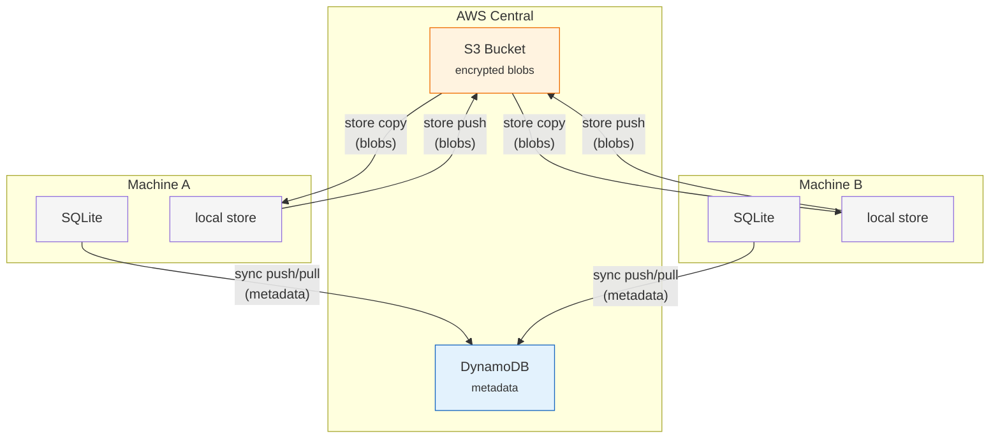

# Central Sync

Multiple machines maintain individual SQLite databases and synchronize to a shared backend (metadata) and S3-compatible store (blob content).

## Architecture



## Two-Layer Sync

| Layer | Commands | Content | Destination |
|-------|----------|---------|-------------|
| Metadata | `sync push` / `sync pull` | snapshots, entries, blobs (rows), replicas | DynamoDB (or PostgreSQL) |
| Blob content | `store push` / `store copy` | encrypted file blobs | S3 |

## Sync Modes

`sync push/pull` detects the URL scheme of the peer:

| URL scheme | Mode |
|------------|------|
| `postgres://...` or `sqlite://...` | Direct DB connection (SeaORM) |
| `http://...` or `https://...` | HTTP API (`POST /sync/push`, `GET /sync/pull`) |

## Authentication

HTTP sync peers can require AWS IAM authentication. Set `"auth": "aws-iam"` in the peer config:

```bash
tome sync add my-aws --repo myrepo --url https://xxxxx.lambda-url.us-west-2.on.aws
tome sync set my-aws --repo myrepo --config '{"auth":"aws-iam","region":"us-west-2"}'
```

| Config key | Description | Default |
|------------|-------------|---------|
| `auth` | Authentication method (`"aws-iam"` or omit for none) | none |
| `region` | AWS region for SigV4 signing | SDK default (`AWS_REGION`) |
| `service` | AWS service name for SigV4 signing | `"lambda"` |

When `"auth": "aws-iam"` is set, requests are signed with AWS SigV4 using credentials from the default chain (`AWS_ACCESS_KEY_ID` / `AWS_SECRET_ACCESS_KEY`, instance profile, SSO, etc.).

`POST /sync/push` is idempotent: duplicate pushes identified by `(source_machine_id, source_snapshot_id)` return the existing server-side snapshot without re-inserting.

## machine_id Allocation

`POST /machines` allocates an unused `machine_id` (valid range: 0–32767; `machine_id = 0` is reserved for local-only use). `tome init --server <url>` calls this endpoint and persists the result to `~/.config/tome/tome.toml`.
