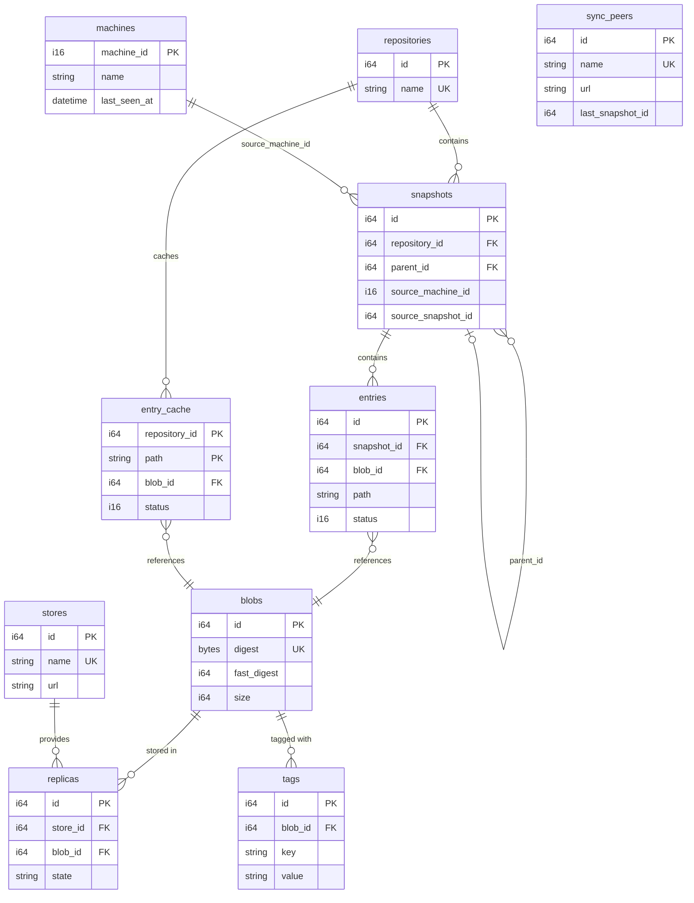

# Database Schema

10 tables. All IDs are Sonyflake `i64` (except `machines.machine_id` which is `i16`). All timestamps are `DateTimeWithTimeZone`.

## ER Diagram



## Table Descriptions

| Table | Description |
|-------|-------------|
| `repositories` | Named scan namespaces (e.g. `default`) |
| `blobs` | Content-addressable file fingerprints (`digest`=SHA-256 or BLAKE3, `fast_digest`=xxHash64) |
| `snapshots` | Scan execution events (analogous to Git commits, chained via `parent_id`). `source_machine_id` / `source_snapshot_id` track sync provenance |
| `entries` | Per-file state within a snapshot (`status`: 0=deleted, 1=present) |
| `entry_cache` | Latest state cache per path, PK=(repository\_id, path) |
| `stores` | Storage backend definitions (`url`: `file:///`, `ssh://`, `s3://`) |
| `replicas` | Tracks which store holds which blob |
| `tags` | Key-value attributes on blobs |
| `sync_peers` | Sync peer definitions (`url` + `last_snapshot_id`) |
| `machines` | Registered machines for central sync (`machine_id` as PK, `name`, `last_seen_at`) |

## entry_cache Limitations

`entry_cache` holds only the **current** (latest) state of each path. Comparing two arbitrary points in time requires querying the `entries` table directly, joined with the relevant snapshots.

## Declarative Schema Management

A canonical DDL file (`tome-db/schema.sql`) is maintained for use with declarative
migration tools such as [psqldef](https://github.com/sqldef/sqldef). This DDL
represents the full target schema and can be applied directly:

```bash
psqldef -U <user> -h <host> <database> < tome-db/schema.sql
```

SeaORM migrations (`tome-db/src/migration/`) are still used by `connection::open()`
(CLI / local SQLite), while `connection::connect()` skips migrations for deployments
where the schema is managed externally.
