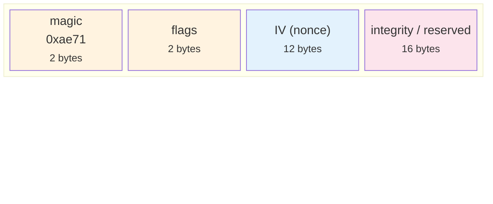
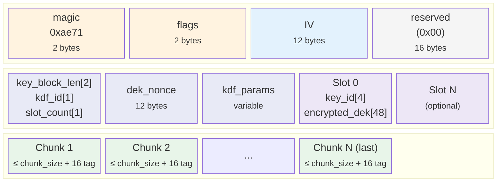

# Encryption

`aether` crate: AES-256-GCM or ChaCha20-Poly1305 authenticated encryption with Argon2id key derivation.

`EncryptedStorage<S>` is implemented in `tome-store/src/encrypted.rs`. It is activated via `tome store copy --encrypt --key-file <path>`.

## Binary Format

### Header (32 bytes, common to all versions)



### Header Flags (16-bit)

```
bits [15:12]  version       — 0 = legacy, 1 = envelope + streaming AEAD
bits [11:8]   reserved      — must be 0
bits [7:4]    chunk_kind    — ciphertext chunk size = 8192 << chunk_kind
bits [3:0]    algorithm     — 0 = AES-256-GCM, 1 = ChaCha20-Poly1305
```

### v0 (Legacy)

Fixed 8 KiB chunks. Nonce = `IV ⊕ counter`. Integrity value appended to plaintext before encryption and verified after full decryption.

### v1 (Envelope Encryption + Streaming AEAD)

v1 combines **KEK/DEK separation** (envelope encryption) with the **STREAM construction**.

#### File Layout



#### Key Roles

| Key | Description |
|-----|-------------|
| **KEK** (Key Encryption Key) | User-provided key (raw 32 bytes or derived from password via Argon2id). Used only to encrypt/decrypt the DEK |
| **DEK** (Data Encryption Key) | Randomly generated 32-byte key per file. Used for AEAD encryption of the actual data |

#### Key Block Layout

```
Offset  Size  Field
─────────────────────────────────────────────
0       2     key_block_len   — total byte length of the Key Block (including this field)
2       1     kdf_id          — 0 = none (raw key), 1 = argon2id
3       1     slot_count      — number of KEK slots (1–255)
4       12    dek_nonce       — nonce for DEK encryption (generated independently from IV)
16      var   kdf_params      — KDF-specific parameters (depends on kdf_id)
var     52×N  slots           — array of KEK slots
```

**kdf_params (kdf_id=0, none)**: empty (0 bytes)

**kdf_params (kdf_id=1, argon2id)**:

```
Offset  Size  Field
─────────────────────────────────────────────
0       16    salt
16      4     m_cost          — memory cost (KiB)
20      4     t_cost          — iterations
24      4     p_cost          — parallelism
```

Total: 28 bytes

**Slot (52 bytes)**:

```
Offset  Size  Field
─────────────────────────────────────────────
0       4     key_id          — first 4 bytes of SHA-256(KEK)
4       48    encrypted_dek   — AEAD(KEK, dek_nonce, DEK, ad=header[0..32])
```

`encrypted_dek` = DEK (32 bytes) + AEAD tag (16 bytes) = 48 bytes.
The file header (32 bytes) is used as associated data so that header tampering is detected at DEK unwrap time.

#### Key Block Size Examples

| Configuration | Size |
|---------------|------|
| raw key, 1 slot | 4 + 12 + 0 + 52 = 68 bytes |
| argon2id, 1 slot | 4 + 12 + 28 + 52 = 96 bytes |
| raw key, 3 slots | 4 + 12 + 0 + 156 = 172 bytes |

#### STREAM Encryption (Data Section)

Data is encrypted using the DEK with the STREAM construction:

- **Nonce**: `IV ⊕ (0x00{4} || counter_u64_BE)`. Last chunk: `nonce[0] ^= 0x80`.
- **AD**: first chunk uses `header[0..32] || key_block` as associated data; subsequent chunks use empty AD.
- **Last-chunk detection**: encrypt uses read-ahead; decrypt tries the normal nonce first, then the last-chunk nonce.
- **chunk_kind**: variable chunk size (default chunk_kind=7 → 1 MiB).
- No integrity suffix needed (STREAM + AEAD tags provide authentication).

#### Processing Flow

**Encryption**:
1. Generate random DEK (32 bytes)
2. Obtain KEK (raw key or Argon2id(password, salt))
3. Build Header (version=1, random IV, reserved=0x00)
4. Build Key Block:
   - Generate random dek_nonce
   - `encrypted_dek = AEAD(KEK, dek_nonce, DEK, ad=header[0..32])`
5. STREAM-encrypt data with DEK + IV
6. Output: `header || key_block || encrypted_chunks`

**Decryption**:
1. Read Header → verify version=1
2. Read Key Block
3. Obtain KEK (raw key or Argon2id(password, kdf_params from Key Block))
4. Find matching slot by key_id (fall back to trying all slots on mismatch)
5. `DEK = AEAD_decrypt(KEK, dek_nonce, encrypted_dek, ad=header[0..32])`
6. STREAM-decrypt data with DEK + IV (first chunk AD = `header || key_block`)

#### Differences from v0

| Aspect | v0 | v1 |
|--------|----|----|
| Key model | Single key used directly for AEAD | KEK → DEK unwrap → AEAD |
| integrity field | Appended to plaintext and verified | reserved (0x00) |
| KDF parameters | Hard-coded | Stored in Key Block |
| Last-chunk marker | None (integrity suffix for indirect detection) | Nonce bit flag |
| Chunk size | Fixed 8 KiB | Selectable via chunk_kind |
| Header authentication | None (detected indirectly via AEAD failure) | Explicit via DEK unwrap AD + first chunk AD |
| Key rotation | Re-encrypt all data | Re-wrap DEK only |

Backward compatible: v0 files (flags=0x0000 or 0x0001) are auto-detected and decrypted correctly.

### chunk_kind Values

Ciphertext chunk size = `8 KiB × 2^chunk_kind`. Plaintext = ciphertext − 16 bytes (AEAD tag).
v0 ignores chunk_kind (always 8 KiB). Effective in v1 and later.

| chunk_kind | Ciphertext Chunk Size | Notes |
|------------|----------------------|-------|
| 0 | 8 KiB | v0 compatible |
| 7 | 1 MiB | v1 default |
| 13 | 64 MiB | Large backups |
| 15 | 256 MiB | High memory usage |

### `encrypt_bytes` / `decrypt_bytes`

File name encryption (`encrypt_bytes` / `decrypt_bytes`) is independent of the streaming format.
It uses single-chunk AEAD with an appended nonce and is unaffected by the format version.

## Module Structure

| Module | Contents |
|--------|---------|
| `error.rs` | `AetherError` enum (thiserror) — all fallible paths |
| `algorithm.rs` | `CipherAlgorithm` enum (`Aes256Gcm` \| `ChaCha20Poly1305`) |
| `header.rs` | `Header`, `HeaderFlags`, `ChunkKind`, `CounteredNonce`, `KeyBlock`, `KeySlot`, constants |
| `cipher.rs` | `Cipher` (v0/v1 dispatch), `AeadInner` enum, encrypt/decrypt methods |

Decryption auto-detects the format version and algorithm from the stored header — no explicit configuration needed at read time.

`Cipher` implements `Drop` via `zeroize` to zero key material on drop. All constructors return `Result<Cipher, AetherError>` (no panics).

## Key Management

The KEK (v1) or direct key (v0) is a 32-byte raw value. Keys are never stored in the database or on remote servers (out-of-band distribution).

Two ways to provide a key:

**`store.key_file`** (path to a 32-byte binary file):
```
~/.config/tome/keys/<key_id>.key    — 32-byte raw binary key
```

**`store.key_source`** (URI, resolved at runtime by `tome-store/src/key_source.rs`):

| URI | Source |
|-----|--------|
| `env://VAR_NAME` | hex or base64 value of an environment variable |
| `file:///path/to/key` | 32-byte binary key file |
| `aws-secrets-manager://secret-id` | AWS Secrets Manager — string (hex/base64) or binary secret |
| `vault://mount/path?field=name` | HashiCorp Vault KV v1/v2 via HTTP (`VAULT_ADDR` + `VAULT_TOKEN`) |
| `pass://entry-name` | [pass](https://www.passwordstore.org/) — runs `pass show <entry>`, parses first line |

`key_file` takes priority over `key_source`. The CLI flags `--key-file` / `--key-source` override the config.

In v1, the provided key is treated as a KEK; the DEK is auto-generated per file.
In v0, the provided key is used directly for data encryption.
