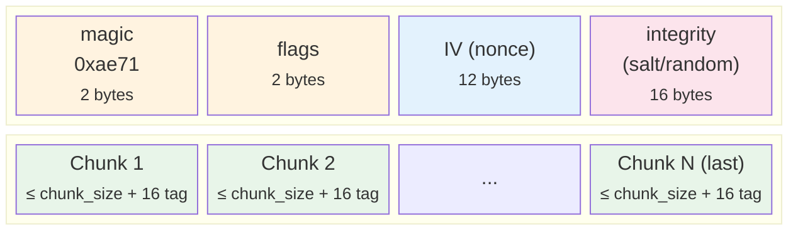

# Encryption

`aether` crate: AES-256-GCM or ChaCha20-Poly1305 authenticated encryption with Argon2id key derivation.

`EncryptedStorage<S>` is implemented in `tome-store/src/encrypted.rs`. It is activated via `tome store copy --encrypt --key-file <path>`.

## Binary Format



### Header Flags (16-bit)

```
bits [15:12]  version       — 0 = legacy, 1 = streaming AEAD
bits [11:8]   reserved      — must be 0
bits [7:4]    chunk_kind    — ciphertext chunk size = 8192 << chunk_kind
bits [3:0]    algorithm     — 0 = AES-256-GCM, 1 = ChaCha20-Poly1305
```

### v0 (Legacy)

Fixed 8 KiB chunks. Nonce = `IV ⊕ counter`. Integrity value appended to plaintext before encryption and verified after full decryption.

### v1 (Streaming AEAD, Default)

Variable chunk size (default chunk_kind=7 → 1 MiB). STREAM construction:

- **Nonce**: `IV ⊕ (0x00{4} || counter_u64_BE)`. Last chunk: `nonce[0] ^= 0x80`.
- **Header AD**: first chunk uses header bytes as associated data; subsequent chunks use empty AD.
- **Last-chunk detection**: encrypt uses read-ahead; decrypt tries normal nonce first, then last-chunk nonce.
- No integrity suffix in plaintext (STREAM provides authentication).

Backward compatible: v0 files (flags=0x0000 or 0x0001) are auto-detected and decrypted correctly.

## Module Structure

| Module | Contents |
|--------|---------|
| `error.rs` | `AetherError` enum (thiserror) — all fallible paths |
| `algorithm.rs` | `CipherAlgorithm` enum (`Aes256Gcm` \| `ChaCha20Poly1305`) |
| `header.rs` | `Header`, `HeaderFlags`, `ChunkKind`, `CounteredNonce`, constants |
| `cipher.rs` | `Cipher` (v0/v1 dispatch), `AeadInner` enum, encrypt/decrypt methods |

Decryption auto-detects the format version and algorithm from the stored header — no explicit configuration needed at read time.

`Cipher` implements `Drop` via `zeroize` to zero key material on drop. All constructors return `Result<Cipher, AetherError>` (no panics).

## Key Management

Keys are 32-byte raw values. They are never stored in the database or on remote servers (out-of-band distribution).

Two ways to provide a key:

**`store.key_file`** (path to a 32-byte binary file):
```
~/.config/tome/keys/<key_id>.key    — 32-byte raw binary key
```

**`store.key_source`** (URI, resolved at runtime by `tome-store/src/key_source.rs`):

| URI | Source |
|-----|--------|
| `env://VAR_NAME` | hex or base64 value of an environment variable |
| `file:///path/to/key` | 32-byte binary key file |
| `aws-secrets-manager://secret-id` | AWS Secrets Manager — string (hex/base64) or binary secret |
| `vault://mount/path?field=name` | HashiCorp Vault KV v1/v2 via HTTP (`VAULT_ADDR` + `VAULT_TOKEN`) |
| `pass://entry-name` | [pass](https://www.passwordstore.org/) — runs `pass show <entry>`, parses first line |

`key_file` takes priority over `key_source`. The CLI flags `--key-file` / `--key-source` override the config.
