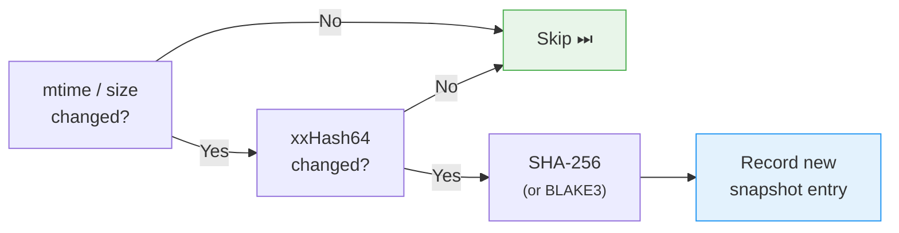

# Hash Strategy

Change detection uses a three-stage filter to minimize I/O:

Both hashes are computed in a single pass through the file in `treblo/src/hash.rs::hash_file()` (re-exported via `tome-core::hash`).

The digest algorithm is configured per repository via `repositories.config["digest_algorithm"]` (default: `"sha256"`). Use `tome scan --digest-algorithm blake3` when creating a new repository. The algorithm cannot be changed after the first scan (digest consistency).
