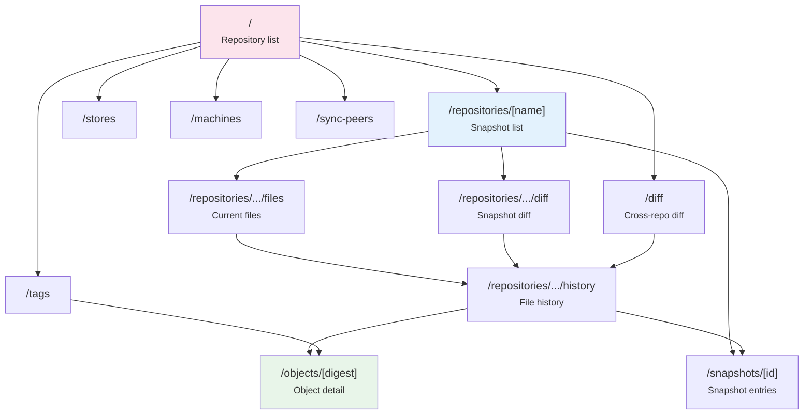

# Web Frontend (tome-web)

Next.js 16 + TypeScript + Tailwind CSS v4 + App Router (Server Components only).

## Directory Structure

```
tome-web/
  src/
    lib/
      api.ts        fetch-based API client (TOME_API_URL env var)
      types.ts      TypeScript type definitions
    app/
      layout.tsx                              root layout (header nav)
      page.tsx                                repository list (/)
      not-found.tsx
      diff/page.tsx                           cross-repo diff (/diff)
      repositories/[name]/page.tsx            snapshot list
      repositories/[name]/files/page.tsx      current files (entry_cache)
      repositories/[name]/diff/page.tsx       per-snapshot diff
      repositories/[name]/history/page.tsx    per-path history
      snapshots/[id]/page.tsx                 snapshot entry list
      objects/[digest]/page.tsx               object detail
      stores/page.tsx                         registered stores
      machines/page.tsx                       registered machines
      tags/page.tsx                           object tags
      sync-peers/page.tsx                     sync peer list
      globals.css                             Tailwind v4 (@import "tailwindcss")
  eslint.config.mjs    ESLint flat config (eslint-config-next 16)
  .prettierrc.json     Prettier config (printWidth: 120)
  env.local.example    TOME_API_URL=http://localhost:8080
  .nvmrc               24
```

## Navigation Structure



## Key Implementation Notes

- All API calls are server-side; no CORS required. `TOME_API_URL` is a server-only env var.
- Every page uses `export const dynamic = "force-dynamic"` to prevent build-time SSG (which would fail if `tome serve` is not running).
- Tailwind v4: `@import "tailwindcss"` in `globals.css` only; no `tailwind.config.ts` needed. PostCSS plugin: `@tailwindcss/postcss`.
